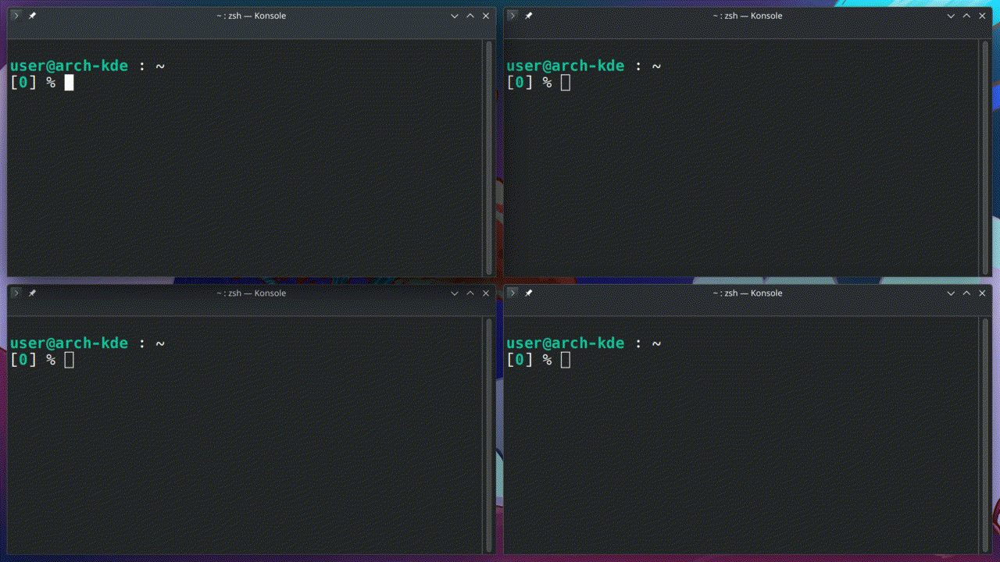

# Zay
Switch among windows by pressing the key. Extension for KWin 6.

Zay works as the set of two programs:

- zay-x.x.x.kwinscript (this repository)
- [key press absorber program]

[key press absorber program]: https://github.com/anametologin/zayka



## Features

- Makes the window active after pressing key with letter that will be shown on that window after pressing Zay shortcut

## Requirements

- kwin 6.x.x
- Desktop session: Plasma(Wayland) (X11 will work too, but not actively supported)
- Running [key press absorber program]

## Development plans

1. Configuration. Add a possibility to change:

- `hop label` place
- `hop label` background color
- `hop label` font size
- display time of `hop label`
- awaiting next keypress time

2. To make able to rise and switch to minimized windows.
3. To make able to switch to other Virtual Desktops windows.

## Development Requirement

- Typescript (tested w/ 5.4.x)
- GNU Make
- p7zip (7z)

## Installation

You have to install __both__ parts: this kwinscript and [key press absorber program]

### Install zay-x.x.x.kwinscript package file

#### You can download `zay-x.x.x.kwinscript` file, and install it through _System Settings_.

1.  Download the kwinscript file
2.  Open `System Settings` > `Window Management` > `KWin Scripts`
3.  Press `Import KWin script...` on the top-right corner
4.  Select the downloaded file

#### Alternatively, through command-line:

    kpackagetool6 -t KWin/Script -i krohnkite.kwinscript # installing new script
    kpackagetool6 -t kwin/script -u krohnkite.kwinscript # upgrading existing script

#### To uninstall the package:

```
kpackagetool6 -t kwin/script -r krohnkite
```

#### Installing from Git repository

The simplest method would be:

    make install
    make uninstall # to uninstall the script

This will automatically build and install kwinscript package.

You can also manually build package file using:

    make package

The generated package file can be imported from "KWin Script" dialog.

### Install [key press absorber program]

1. Add zayka binary file to any place and add it to autostart.
   To add to autostart:

- type in KDE search `autostart`
- push `+Add...` button and choose `+Add Application`
- beside edit box, there is button `open file dialog` - push it
- search and choose zayka binary file and push `Open` and `Ok`

2. Reboot.
